# 🧅 BTor – Tor Service & Browser Manager

**BTor** is a single-file installer + manager for **Tor service** and **Tor Browser**, designed to simplify setup and management on Linux systems.

It automatically:

* Installs and manages **Tor CLI & systemd service**
* Downloads and configures **Tor Browser**
* Ensures **Node.js/npm/npx** are available (for related tooling)
* Provides an **interactive menu** for managing Tor service

---

## 📦 Installation

Run this one-liner to download, install, and set up BTor:

```bash
curl -fsSL https://raw.githubusercontent.com/linux-brat/BTor/main/btor.sh -o /tmp/btor.sh \
  && chmod +x /tmp/btor.sh \
  && /tmp/btor.sh install
```

Once installed, simply run:

```bash
btor
```

---

## 🔧 Usage

### CLI Commands

```bash
btor                       # Launch interactive menu
btor start                 # Start Tor service
btor stop                  # Stop Tor service
btor restart               # Restart Tor service
btor enable                # Enable Tor at boot
btor disable               # Disable Tor at boot
btor status [--full]       # Show service status
btor update                # Update BTor
btor uninstall             # Uninstall BTor
```

### Interactive Menu

When you run `btor` without arguments, you’ll get an interactive menu:

```
1) Start tor.service
2) Stop tor.service
3) Enable at boot
4) Disable at boot
5) Restart tor.service
6) Show full status
7) Update BTor
8) Uninstall BTor
9) Quit
```

---

## ⚙️ Environment Variables

| Variable               | Default                      | Description                       |
| ---------------------- | ---------------------------- | --------------------------------- |
| `BTOR_SERVICE_NAME`    | `tor.service`                | Override Tor systemd service name |
| `BTOR_HOME`            | `~/.btor`                    | Installation directory            |
| `BTOR_BIN_LINK`        | `/usr/local/bin/btor`        | Symlink path for global access    |
| `BTOR_REPO_RAW`        | GitHub raw script URL        | Where updates are fetched from    |
| `BTOR_TOR_BROWSER_DIR` | `~/.local/tor-browser`       | Where Tor Browser is installed    |
| `BTOR_TB_URL`          | Official Tor Browser tarball | Override download URL             |

Example:

```bash
BTOR_SERVICE_NAME=tor@default.service btor start
```

---

## 🌀 Flowchart

### Installation Flow

```mermaid
flowchart TD
    A[Run curl install command] --> B[Download btor.sh]
    B --> C[Install BTor to ~/.btor]
    C --> D[Symlink /usr/local/bin/btor]
    D --> E[Run First-Time Setup]
    E --> F[Check Tor CLI & Service]
    E --> G[Check Tor Browser]
    E --> H[Check Node.js/npm/npx]
    F --> I[BTor ready 🎉]
    G --> I
    H --> I
```



### Runtime Flow


---

## ✅ Requirements

* **Linux** with `bash`
* **systemd** (`systemctl` required)
* `curl`
* `sudo` access (for service actions and symlink)

---

## 📖 Examples

### Install BTor

```bash
curl -fsSL https://raw.githubusercontent.com/linux-brat/BTor/main/btor.sh -o /tmp/btor.sh \
  && chmod +x /tmp/btor.sh \
  && /tmp/btor.sh install
```

### Start Tor service

```bash
btor start
```

### Stop Tor service

```bash
btor stop
```

### Enable Tor at boot

```bash
btor enable
```

### Check full service status

```bash
btor status --full
```

### Update BTor itself

```bash
btor update
```

### Uninstall BTor

```bash
btor uninstall
```

---

## 📜 License

MIT License © 2025 [linux-brat](https://github.com/linux-brat)
