<p align="center">
  <strong>⚠️ WARNING: This project is only tested on Arch Linux ⚠️</strong>
</p>

---

<h1 align="center">🧅 BTor – Tor Service & Browser Manager</h1>

<p align="center">
  Simple CLI + Manager for Tor Service & Tor Browser on Linux
</p>

---

<p align="center">
  
  
  
  
</p>

<p align="center">
  
  
  
</p>

<p align="center">
[![GitButler](https://img.shields.io/badge/GitButler-%23B9F4F2?logo=data%3Aimage%2Fsvg%2Bxml%3Bbase64%2CPHN2ZyB3aWR0aD0iMzkiIGhlaWdodD0iMjgiIHZpZXdCb3g9IjAgMCAzOSAyOCIgZmlsbD0ibm9uZSIgeG1sbnM9Imh0dHA6Ly93d3cudzMub3JnLzIwMDAvc3ZnIj4KPHBhdGggZD0iTTI1LjIxNDUgMTIuMTk5N0wyLjg3MTA3IDEuMzg5MTJDMS41NDI5NSAwLjc0NjUzMiAwIDEuNzE0MDYgMCAzLjE4OTQ3VjI0LjgxMDVDMCAyNi4yODU5IDEuNTQyOTUgMjcuMjUzNSAyLjg3MTA3IDI2LjYxMDlMMjUuMjE0NSAxNS44MDAzQzI2LjcxOTcgMTUuMDcyMSAyNi43MTk3IDEyLjkyNzkgMjUuMjE0NSAxMi4xOTk3WiIgZmlsbD0iYmxhY2siLz4KPHBhdGggZD0iTTEzLjc4NTUgMTIuMTk5N0wzNi4xMjg5IDEuMzg5MTJDMzcuNDU3MSAwLjc0NjUzMiAzOSAxLjcxNDA2IDM5IDMuMTg5NDdWMjQuODEwNUMzOSAyNi4yODU5IDM3LjQ1NzEgMjcuMjUzNSAzNi4xMjg5IDI2LjYxMDlMMTMuNzg1NSAxNS44MDAzQzEyLjI4MDMgMTUuMDcyMSAxMi4yODAzIDEyLjkyNzkgMTMuNzg1NSAxMi4xOTk3WiIgZmlsbD0idXJsKCNwYWludDBfcmFkaWFsXzMxMF8xMjkpIi8%2BCjxkZWZzPgo8cmFkaWFsR3JhZGllbnQgaWQ9InBhaW50MF9yYWRpYWxfMzEwXzEyOSIgY3g9IjAiIGN5PSIwIiByPSIxIiBncmFkaWVudFVuaXRzPSJ1c2VyU3BhY2VPblVzZSIgZ3JhZGllbnRUcmFuc2Zvcm09InRyYW5zbGF0ZSgxNi41NzAxIDE0KSBzY2FsZSgxOS44NjQxIDE5LjgzODMpIj4KPHN0b3Agb2Zmc2V0PSIwLjMwMTA1NiIgc3RvcC1vcGFjaXR5PSIwIi8%2BCjxzdG9wIG9mZnNldD0iMSIvPgo8L3JhZGlhbEdyYWRpZW50Pgo8L2RlZnM%2BCjwvc3ZnPgo%3D)](https://gitbutler.com/)
</p>


---

## 📸 Screenshots

Here’s a quick visual tour of BTor’s interface and flows:

<div align="center">

### ⚡ First-Time Setup


### ❓ Help


### 🏠 Main Menu


### 🌐 Browser Proxy (Firefox)


### 🧪 Tor Route Test


</div>

---

## 📦 Installation

Run this one-liner to download, install, and set up BTor:

```bash
curl -fsSL https://raw.githubusercontent.com/linux-brat/BTor/main/btor.sh -o /tmp/btor.sh \
  && chmod +x /tmp/btor.sh \
  && /tmp/btor.sh install
```

Once installed, simply run:

```bash
btor
```

---

## 🔧 Usage

### CLI Commands

```bash
btor                       # Launch interactive menu
btor start                 # Start Tor service
btor stop                  # Stop Tor service
btor restart               # Restart Tor service
btor enable                # Enable Tor at boot
btor disable               # Disable Tor at boot
btor status [--full]       # Show service status
btor update                # Update BTor
btor uninstall             # Uninstall BTor
```

### Interactive Menu

When you run `btor` without arguments, you’ll get an interactive menu:

```bash
1) Start tor.service
2) Stop tor.service
3) Enable at boot
4) Disable at boot
5) Restart tor.service
6) Show full status
7) Update BTor
8) Uninstall BTor
9) Quit
```

---

## ⚙️ Environment Variables

| Variable               | Default                  | Description                       |
| ---------------------- | ------------------------ | --------------------------------- |
| `BTOR_SERVICE_NAME`    | `tor.service`            | Override Tor systemd service name |
| `BTOR_HOME`            | `~/.btor`                | Installation directory            |
| `BTOR_BIN_LINK`        | `/usr/local/bin/btor`    | Symlink path for global access    |
| `BTOR_REPO_RAW`        | GitHub raw script URL    | Where updates are fetched from    |
| `BTOR_TOR_BROWSER_DIR` | `~/.local/tor-browser`   | Where Tor Browser is installed    |
| `BTOR_TB_URL`          | Official Tor tarball URL | Override download URL             |

Example:

```bash
BTOR_SERVICE_NAME=tor@default.service btor start
```

---

## 🌀 Flowchart

### Installation Flow (Mermaid)

```mermaid
flowchart TD
    A[Run curl install command] --> B[Download btor.sh]
    B --> C[Install BTor to ~/.btor]
    C --> D[Symlink /usr/local/bin/btor]
    D --> E[Run First-Time Setup]
    E --> F[Check Tor CLI & Service]
    E --> G[Check Tor Browser]
    E --> H[Check Node.js/npm/npx]
    F --> I[BTor ready 🎉]
    G --> I
    H --> I
```



### Runtime Flow (Mermaid)


---

## ✅ Requirements

* Linux with `bash`
* systemd (`systemctl` required)
* `curl`
* `sudo` access (for service actions and symlink)

---

## 📜 License

MIT License © 2025 [linux-brat](LICENSE)
